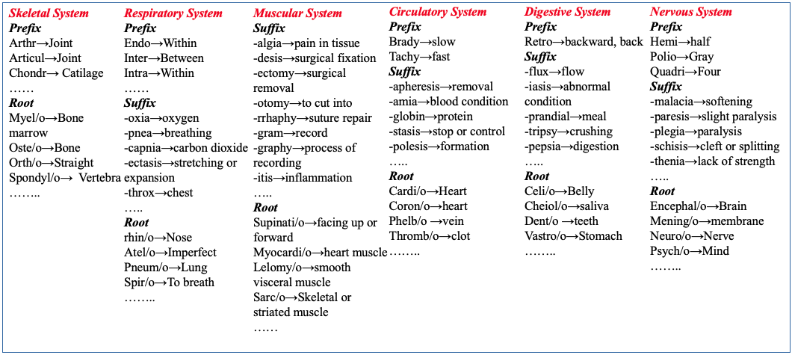

# MedTCS

This project aims to provide an Medical Terminology based Computing System (MedTCS): a
lightweight post-processing solution for out-of-vocabulary multi-word terms. 
MedTCS is a natural language processing system helps the distributed representation models (like: Word2Vec, GloVe) to handle the OOV problem effectively. 

The below image shows how the biomedical/clinical terms components deliver a maningful information.

## Meta-data Collection
In MedTCS, we have build meta-dictionaries for the prefixes, roots, and suffixes defining the meanings of medical term components. The three semantic
dictionaries contain 467 [root words](https://github.com/NadiaSaeed/MedTCS/blob/9406ab861c60de0d1026d88261409051b3ee4106/MedTCS-root.csv), 432 [prefixes](https://github.com/NadiaSaeed/MedTCS/blob/9406ab861c60de0d1026d88261409051b3ee4106/MedTCS-prefix.csv), and 112 [suffixes](https://github.com/NadiaSaeed/MedTCS/blob/9406ab861c60de0d1026d88261409051b3ee4106/MedTCS-suffix.csv), along with their corresponding
meanings as shown in [Fig 1](https://github.com/NadiaSaeed/MedTCS/blob/9406ab861c60de0d1026d88261409051b3ee4106/Figure1.png).

## MedTCS Framework
MedTCS module to encode OOV words from a set of sentences or words have following steps:   
- OOV Word Detector   
- Pluralizer/Singularizer     
- Term Parser    
- Term Segmenter      
     

## MedTCS:Term Segmenter model
The pre-trained [term segmenter model](https://github.com/NadiaSaeed/MedTCS/blob/9406ab861c60de0d1026d88261409051b3ee4106/Morphmodel.bin) returned meaningful sub-words of an unknown term (like seasickness → sea+sick+ness).

[MedTCS module](https://github.com/NadiaSaeed/MedTCS/blob/9406ab861c60de0d1026d88261409051b3ee4106/MedTCS.ipynb) enabled the word embedding models to encode the vector for OOV terms from its search-space effectively.
